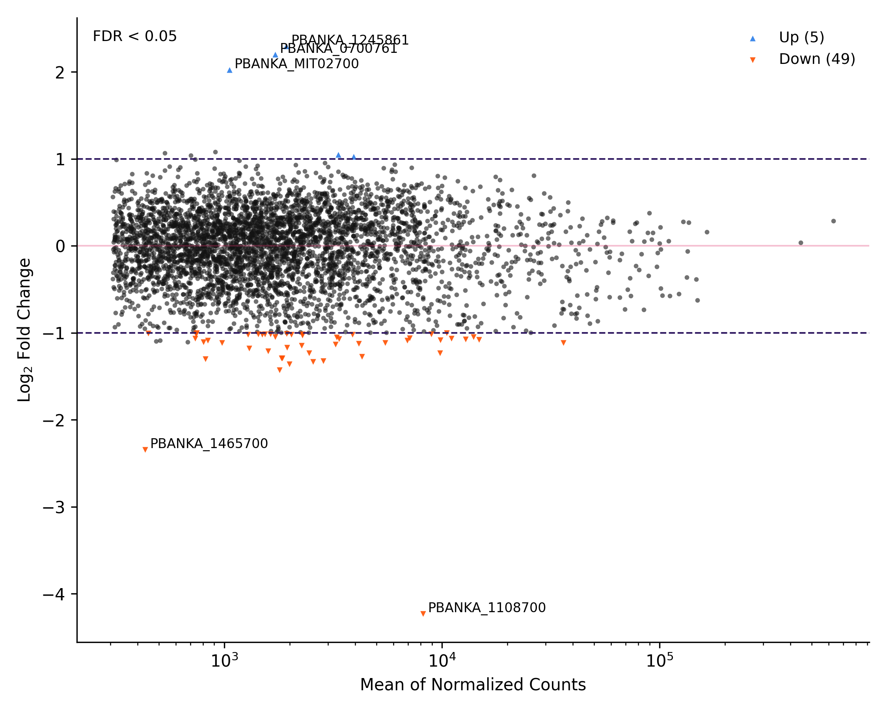

# RNA-seq Analysis Pipeline

End-to-end bulk RNA-seq analysis workflow used for *Plasmodium berghei* – WT vs SMC4 knockdown
transcriptomics experiments. Public data obtained from [Tewari, R., et al. Cell Rep., 2020
](https://pmc.ncbi.nlm.nih.gov/articles/PMC7016506/)

Reads must be downloaded from SRA PRJNA542367 and placed under `reads/untrimmed/` – We do this below.

## Pipeline steps:

1. Quality control (FastQC)
2. Adapter and reads trimming (fastp)
3. Contamination screening (FastQ Screen)
4. Alignment (HISAT2)
5. Deduplication (marking only)
6. Feature counting (featureCounts)
7. Differential expression (DESeq2 + edgeR)
8. Visualization (heatmap, volcano plots)

## Downloading the data

You need the following reads, or just use your own – Adjust `config/samples.tsv` and `config/background.tsv` for a custom analysis
```
WT: SRR9041561 – SRR9041562
SMC4KD: SRR9041565 – SRR9041566
```

1. First, download the SRA toolkit from https://github.com/ncbi/sra-tools/wiki/01.-Downloading-SRA-Toolkit

1. Download the SRA toolkit
   ```
   wget --output-document sratoolkit.tar.gz https://ftp-trace.ncbi.nlm.nih.gov/sra/sdk/current/sratoolkit.current-ubuntu64.tar.gz
   ```

1. Extract the contents of the tar file:
   ```
   tar -xzf sratoolkit.3.4.0-ubuntu64.tar.gz
   ```

1. Add the binaries to your PATH (adjust the file path for yourself)
   ```
   echo 'export PATH=$PATH:$HOME/projects/research/NGS/sratoolkit.3.4.0-ubuntu64/bin' >> ~/.bashrc
   
   source ~/.bashrc
   ```

1. Check that the system recognizes the new version
   ```
   prefetch --version
   ```

1. Configure the toolkit
   ```
   vdb-config --interactive
   ```

   * In the text-based menu, navigate to the "Cache" tab (press C).
   * Ensure "Enable Local Caching" is toggled on.
   * Check the "Location of user-repository" to make sure it points to a directory where you have plenty of disk space (important for large RNA-seq datasets).
   * Press "S" to save and "X" to exit.

1. Add exec priviliges to the download script and run it
   ```
   chmod +x ./download_sra.sh

   ./download_sra.sh accessions.txt
   ```

1. Download the background genomes for contamination analysis
   ```
   chmod +x ./download_background.sh

   ./download_background.sh
   ```

## Run pipeline

1. Create and activate environment
   ```
   conda env create -f environment.yaml
   conda activate rnaseq
   ```
2. Configure paths in: `workflow/00_vars.sh`
3. Run workflow
   ```
   chmod +x ./run_workflow.sh
   bash ./run_workflow.sh
   ```

## Example Output

### Volcano plot



### Differential expression heatmap


